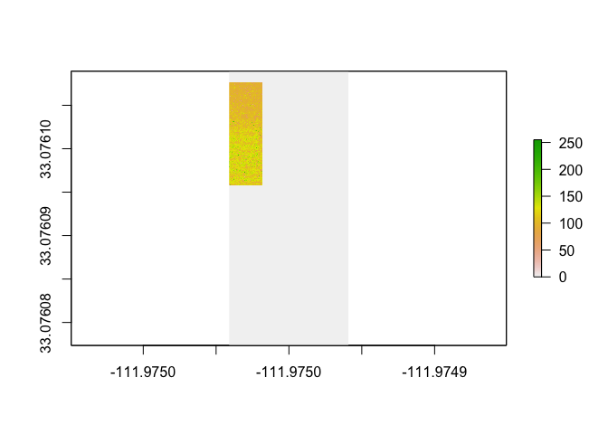
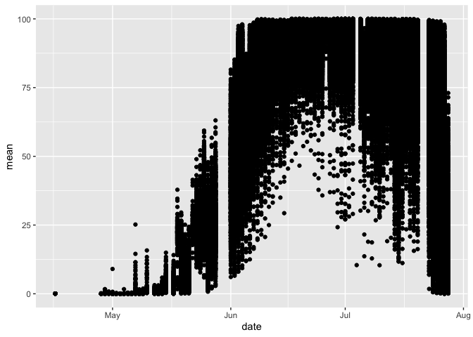
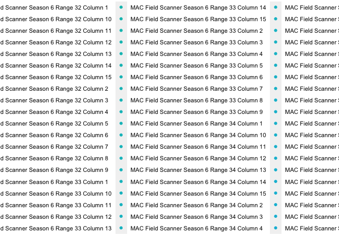
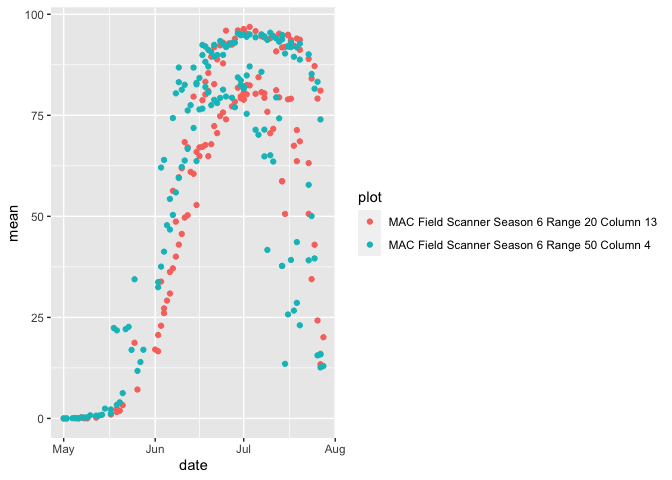
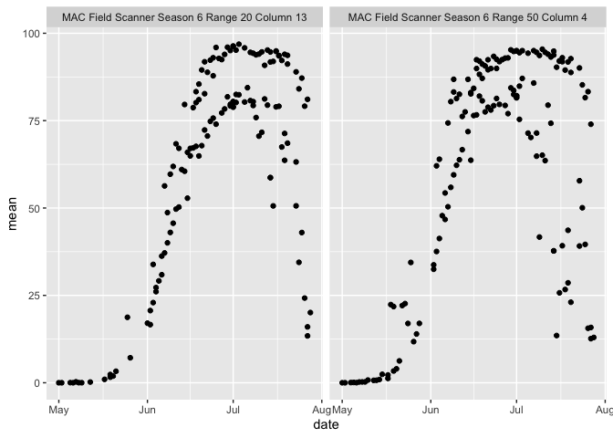
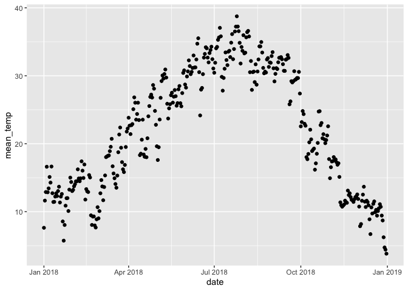
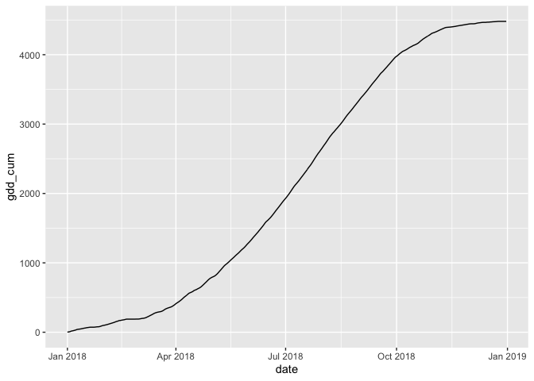
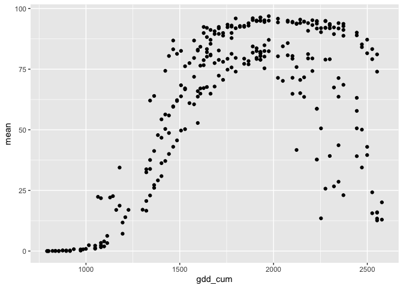
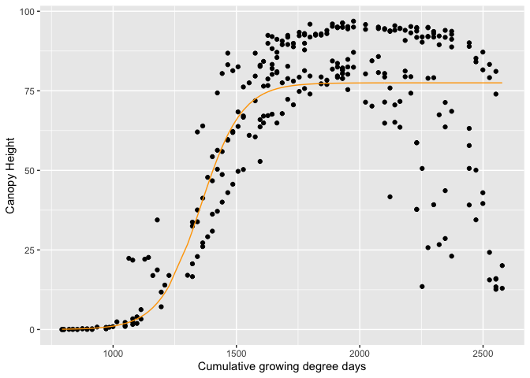

NAPPN 2021 TERRA REF workshop notes
================
Kristina Riemer

# Workshop details

Title: Using TERRA REF high throughput, sensor-collected plant data with
R

Date: Tuesday February 16, 2021

Time: 8:30am - 11:00am CST

## Agenda - Kristina

EST:

  - 9:30 - 10:00: Installation time/troubleshooting
  - 9:30 - 10:00: Overview of TERRA REF experiment
  - 10:00 - 10:30: Downloading sensor data from Globus
  - 10:30 - 10:35: break
  - 10:35 - 11:00: Using sensor data from Globus
  - 11:00 - 11:25: Using trait data with R
  - 11:25 - 11:30: break
  - 11:30 - 11:50: Using weather data with R, combining trait & weather
    data
  - 11:50 - 12:00: TERRA REF data review, wrap-up

AZ time:

  - 7:30 - 8:00: Installation time/troubleshooting
  - 7:30 - 8:00: Overview of TERRA REF experiment
  - 8:00 - 8:30: Downloading sensor data from Globus
  - 8:30 - 8:35: break
  - 8:35 - 9:00: Using sensor data from Globus
  - 9:00 - 9:25: Using trait data with R
  - 9:25 - 9:30: break
  - 9:30 - 9:50: Using weather data with R, combining trait & weather
    data
  - 9:50 - 10:00: TERRA REF data review, wrap-up

### Download/install - Kristina

1.  Sign up for Globus account on <https://www.globus.org/>
2.  Download Globus Connect Personal
      - At <https://www.globus.org/globus-connect-personal>
      - Follow automated setup steps
3.  Download R and RStudio
      - R at <https://www.r-project.org/>
      - RStudio at <https://rstudio.com/products/rstudio/download/>
      - R packages: raster, dplyr, ggplot2
4.  Download Dryad data
      - Download manually at
        <https://datadryad.org/stash/dataset/doi:10.5061/dryad.4b8gtht99>
        by clicking blue “Download dataset” button OR
      - Download with R using code below

<!-- end list -->

``` r
local_path <- "dryad_data.zip"
dryad_url <- ""
download.file(url = dryad_url, destfile = local_path)
unzip(local_path)
```

## Data overview - David

The purpose of this walkthrough is to provide an introduction the TERRA
REF public domain high throughput phenomics datasets (LeBauer et al
2020), and to give learners a chance to access and explore a
representative cross section of these data.

In addition to this workshop, we have online tutorials for using these
data at <https://terraref.github.io/tutorials/>. There are also
materials from previous walkthrough workshops at
<https://github.com/terraref/tutorials/tree/master/videos>. We are
striving to make these data as accessible and usable as possible.

TERRA REF is a project funded by the Advanced Research Projects Agency
for Energy (ARPA-E). The objective is to advance the science and
technology of high throughput field phenotyping, which is the automated
measurement of plant traits. The TERRA REF field scanner is the world’s
largest agricultural robot and is capable of collecting data from a
range of sensors at 1 mm spatial resolution. You can learn more about
the project from the website, [terraref.org](https://terraref.org) and
the documentation, [docs.terraref.org](https://docs.terraref.org). The
suite of sensors include visible light cameras, hyperspectral cameras, a
laser 3d scanner, and environmental data. These are provided alongside a
suite of traits collected by hand as well as derived from sensors. Along
with these data are high resolution genome sequences for hundreds of
varieties of Sorghum being monitored as well as soil, weather, and other
environmental data.

### Experimental design - David

(Show picture of site) Field site is in Arizona. Field is passed over by
large robot called a gantry. Lot of equipment in hanging box to collect
many types of data.

Gantry goes systematically over entire field once a day. Some sensors
take data every day, like 9,000 images from RGB camera. Others more
intermittently, like hyperspectral images, because of data space limits.

Sensors include:

  - camera that takes stereo pairs of red-green-blue images (**Stereo
    RGB**)
  - thermal infrared images (**FLIR**)
  - hyperspectral images of over 1000 wavelengths at 2/3 (VNIR) or 12
    (SWIR) nm spectral resolution (**VNIR/SWIR**)
  - laser that produces a depth map image that is converted to 3D point
    clouds (**3D Laser**)
  - time series of 100 images capturing plant fluorescence response
    (**PS II Fluor**)
  - other data, including environmental data such as temperature and
    light

Collecting data since 2015, and are up to 8 seasons worth in that time.
Originally for sorghum, but now open to other crop species and
organizations that want to use system.

### Traitvis webapp - David

The easiest way to start to visualize and understand the TERRA REF data
is through the Traitvis shiny app website. Go to
[terraref.org/traitvis/](https://terraref.org/traitvis/); this takes a
minute to load because there is so much data, and *may freeze if
everyone does it at once*\! It displays time plots of trait data as well
as maps and thumbnails of field scans.

As example, we’ll look at data from Season 6, which we looked at last
week, by going to “MAC Season 6” tab.

Can choose different variables and cultivars. Select “Canopy Cover” from
first dropdown and second dropdown to “PI656026” to look at cultivar
from last time. How much ground is covered increases across year with
max at 100. Hover over parts of graph to get specific values.

Change second dropdown to “None” to get all cultivars. Select “Map” tab
to look at data spatially. Shows long field in Maricopa, Arizona.

Field is split up into plots. Referenced using range by column system,
can see by hovering over map.

Can choose data within season with slider bar. Set to July 25, or
2018-07-25. Takes a moment to pull data for that date.

Currently shows canopy cover value for each plot. See for single plot
“Range 20 Column 1”. Zoom in on lower left hand part. Hover over that
and see a canopy cover value of ~18%.

These data are summarized from camera data, can see that by unselecting
“Heat Map” button on left. These are downscaled versions of infrared
data. Main image data are infrared and RGB.

### Dryad data - Kristina

There is a lot of data available from TERRA REF. One of the easier entry
points to using the data are on the data repository Dryad. This contains
documentation about data, derived trait data, weather data, and
information about the sensor and genomic data. This is currently only
for two seasons of data.

Let’s look at what’s in Dryad download by navigating in file system to
folder with Dryad data.

**README** Best place to start is with the README called
`README_terraref_dryad.pdf`. It’s a short but detailed document about
the entire project, with specific references to what’s in this Dryad
download. Particularly useful plot on page 8, which shows the different
types of data collected and the time periods they were collected.

**Code folder** This contains everything needed to produce content in
this folder, from the data stored on our database Bety.

**Metadata folder** Additional metadata in the metadata folder about
sensors and genomic data. Subfolder also has two sources of weather
data, which we’ll work with later.

**Traits folder** Traits folder has trait data for two seasons. Trait
data were derived from sensor data or collected manually. There’s is one
csv per type and method of data. Naming convention here is
`season_variable_method.csv`. We’ll also work in R with some of these in
a bit.

**Sensors folder** Lastly is the sensor folder, which has some machine
readable metadata about the sensor data, which we’ll explore as a
jumping off point to actually downloading and looking at some data.

## Sensor data - Kristina

### Metadata - Kristina

Navigate into `sensors/season_6_catalog`. Can see folders for each of
the types of sensor data. In `rgb_geotiff_plots`, there are a bunch of
json files. These are formatted nicely for computers to understand, but
aren’t always easy to read ourselves.

Open up first file
`file_catalog_season6_rgb_geotiff_plots_2018-04-16.json`. Lots of info
available, but we’ll use data after first instance of `path`. This is a
file path, help us locate this file on Globus. Path is
`season-6/sites/ua-mac/Level_1_Plots/rgb_geotiff/2018-04-16/MAC Field
Scanner Season 6 Range 44
Column 7/rgb_geotiff_L1_ua-mac_2018-04-16__10-17-18-788_left.tif`.

### Download from Globus - Kristina

[out of date
instructions](https://docs.terraref.org/user-manual/how-to-access-data/)

Now we have to set up Globus to be able to download data from TERRA REF
to our computer. Data on Globus is transferred between endpoints. Need
one endpoint for our computer and the endpoint for the data source.

Go to globus.org and sign into account. Go to Endpoints in left hand
side menu and click on “Administered By You” tab. After following
automated setup for Globus download, should have a local endpoint listed
here.

(Optional possible step: Create personal endpoint by opening up Globus
Connect, go to Preferences, to Access, click + button, select local
folder (maybe Desktop for now), select “Writable” tab)

We’ll need to add the TERRA REF endpoint. In “Search all endpoints” bar
in upper right, type in \#Terraref. Add endpoint that pops up by
clicking on it. TODO: ask if Jessica can test this

Transfer that RGB image from TERRA REF endpoint to our endpoint. Click
on File Manager. In left side “Collection” bar, select personal
endpoint. In right side “Collection” bar, select TERRA REF endpoint.

In right hand file system, navigate to
`/ua-mac/Level_1_Plots/rgb_geotiff/2018-04-16/MAC Field Scanner Season 6
Range 44 Column 7/`. Can specify local path too. Transfer to local
Globus endpoint in same root folder as Dryad data by submitting
transfer. Can see job by clicking “View details” link in green pop up
box. Show file locally.

### Plot - Kristina

R has a pretty good set of tools for working with spatial data. One of
these is `raster` package, which is good for gridded data like this RGB
image.

``` r
library(raster)
```

    ## Warning: package 'raster' was built under R version 3.6.2

    ## Loading required package: sp

    ## Warning: package 'sp' was built under R version 3.6.2

``` r
single_RGB <- raster("rgb_geotiff_L1_ua-mac_2018-04-16__10-17-18-788_left.tif")
plot(single_RGB)
```

<!-- -->

TODO: add clipping?

There’s a lot of other sensor data that was collected and can be
accessed in a similar way.

## Trait data - Kristina

Other available data and tools in Dryad download, including code and
instructions for how to generate the data here from the database Bety,
high resolution field scanner weather data, and metadata for sensor data
and genomics data.

### Read in data - Kristina

Go back to trait data in Dryad download. The way each csv is structured
is there is a row per date, location, cultivar, and trait. We’ll look at
canopy cover, which is derived from RGB images, for that. Walk through
columns, noting that `mean` is the actual
value.

``` r
canopy_cover <- read.csv("dryad_data/traits/season_6_traits/season_6_canopy_cover_sensor.csv")
str(canopy_cover)
```

    ## 'data.frame':    110637 obs. of  12 variables:
    ##  $ plot          : Factor w/ 780 levels "MAC Field Scanner Season 6 Range 10 Column 1",..: 328 327 316 323 330 671 579 669 22 21 ...
    ##  $ scientificname: Factor w/ 1 level "Sorghum bicolor": 1 1 1 1 1 1 1 1 1 1 ...
    ##  $ genotype      : Factor w/ 326 levels "PI144134","PI145619",..: 326 326 326 326 93 247 120 185 216 242 ...
    ##  $ treatment     : Factor w/ 1 level "MAC Season 6: Sorghum": 1 1 1 1 1 1 1 1 1 1 ...
    ##  $ date          : Factor w/ 86 levels "2018-04-16","2018-04-28",..: 81 81 81 81 81 81 81 81 81 81 ...
    ##  $ trait         : Factor w/ 1 level "canopy_cover": 1 1 1 1 1 1 1 1 1 1 ...
    ##  $ method        : Factor w/ 1 level "Green Canopy Cover Estimation from Field Scanner RGB images": 1 1 1 1 1 1 1 1 1 1 ...
    ##  $ mean          : num  70 72.2 71.3 71.7 46.9 ...
    ##  $ checked       : int  0 0 0 0 0 0 0 0 0 0 ...
    ##  $ author        : Factor w/ 1 level "Zongyang, Li": 1 1 1 1 1 1 1 1 1 1 ...
    ##  $ season        : Factor w/ 1 level "Season 6": 1 1 1 1 1 1 1 1 1 1 ...
    ##  $ method_type   : Factor w/ 1 level "sensor": 1 1 1 1 1 1 1 1 1 1 ...

Note that date is a factor. We’ll need it to be in date format for
plotting. Using common package for data exploration and cleaning.

``` r
library(dplyr)
```

    ## Warning: package 'dplyr' was built under R version 3.6.2

    ## 
    ## Attaching package: 'dplyr'

    ## The following objects are masked from 'package:raster':
    ## 
    ##     intersect, select, union

    ## The following objects are masked from 'package:stats':
    ## 
    ##     filter, lag

    ## The following objects are masked from 'package:base':
    ## 
    ##     intersect, setdiff, setequal, union

``` r
canopy_cover <- canopy_cover %>% 
  mutate(date = as.Date(date))
```

### Plot data - Kristina

Plot data as time series.

``` r
library(ggplot2)
ggplot(data = canopy_cover, aes(x = date, y = mean)) +
  geom_point()
```

<!-- -->

``` r
ggplot(data = canopy_cover, aes(x = date, y = mean, color = plot)) +
  geom_point()
```

<!-- -->

That’s a lot of data, so look at just one cultivar. Get this from the
traitvis cultivar menu.

``` r
cultivar <- "PI656026"
canopy_cover_cultivar <- canopy_cover %>% 
  filter(genotype == cultivar)

ggplot(data = canopy_cover_cultivar, aes(x = date, y = mean, color = plot)) +
  geom_point()
```

<!-- -->

``` r
ggplot(data = canopy_cover_cultivar, aes(x = date, y = mean)) +
  geom_point() +
  facet_wrap(~plot)
```

<!-- -->

## Weather data - Kristina

### Read in data - Kristina

Weather data in Dryad download for the field site and the two years that
the two seasons were collected. Navigate to `metadata/weather/`, we’ll
be using the `azmet` data. There are csv files for 2017 and 2018, and
daily and hourly data. Want to get data for the right year to correspond
to canopy cover data, cause we’ll combine them later.

``` r
range(canopy_cover$date)
```

    ## [1] "2018-04-16" "2018-07-28"

So 2018 data, and we’ll use hourly because we’ll need sub-daily values
later.

``` r
weather <- read.csv("dryad_data/metadata/weather/azmet/azmet_2018_hourly.csv")
```

There are no column names. These are in README in `azmet` folder. In
“HOURLY FILES” section.

Calculate date from year and day of year, to go with date in canopy
cover. Then calculate mean temperature. Pull out just date and
temperature column. Use dplyr tools to get mean daily temp.

``` r
temp_2018_daily <- weather %>% 
  mutate(date = as.Date(X1, origin = "2017-12-31")) %>% 
  select(date, X4.4) %>% 
  rename(temperature = X4.4) %>% 
  group_by(date) %>% 
  summarize(mean_temp = mean(temperature))
```

### Plot data - Kristina

``` r
ggplot(temp_2018_daily, aes(x = date, y = mean_temp)) +
  geom_point()
```

<!-- -->

## Calculations and modelling - Kristina

### Calculate GDD - Kristina

We’ll calculate a metric from temperature called growing degree days.
Basically a simple measure of how much heat plants have been exposed to
over time during the year. Affects a lot of plant physiological
processes like flowering.

Go back a few steps to get hourly temperature values. The value actually
needed for GDD is the mean of lowest and highest temps, so add that
calculation in as a new column.

``` r
temp_for_gdd <- weather %>% 
  mutate(date = as.Date(X1, origin = "2017-12-31")) %>% 
  select(date, X4.4) %>% 
  rename(temperature = X4.4) %>% 
  group_by(date) %>% 
  summarize(min_temp = min(temperature), 
            max_temp = max(temperature), 
            avg_temp = (max_temp + min_temp) / 2)
```

GDD is measure of the accumulation of heat over time that a plant is
exposed to, but only above a chosen base temperature. The amount of heat
a plant is exposed to affects timing and ability to grow, produce
flowers, ect.

Set a base temp as 10, then combine with average temp to get GDD.

Use an ifelse to set that up. If the mean temp is above the base temp,
then take mean temp and subtract base temp of 10 to indicate degrees of
heat they’re exposed to that day. Anything below base temp gets no
degrees.

``` r
base_temp <- 10
gdd <- temp_for_gdd %>% 
  mutate(gdd = ifelse(avg_temp > base_temp, avg_temp - base_temp, 0))
```

This is amount of heat each day they’re exposed to. We want to know
total amount they’ve been exposed to over the year. Use built-in cumsum
to add each day’s degrees onto total.

``` r
gdd <- temp_for_gdd %>% 
  mutate(gdd = ifelse(avg_temp > base_temp, avg_temp - base_temp, 0), 
         gdd_cum = cumsum(gdd)) %>% 
  select(date, gdd_cum)
```

Plot to see what that looks like.

``` r
ggplot(gdd, aes(x = date, y = gdd_cum)) +
  geom_line()
```

<!-- -->

### Combine and model trait and weather data - Kristina

We’re going to put these gdd calculations with canopy cover for one
cultivar and model the relationship between them.

``` r
cover_gdd <- left_join(canopy_cover_cultivar, gdd, by = "date") %>% 
  select(date, mean, gdd_cum)
```

Before modeling any data, should look at it. With more heat, cover
increases quite quickly before asymptoting.

``` r
ggplot(cover_gdd, aes(x = gdd_cum, y = mean)) +
  geom_point()
```

<!-- -->

Seems like logistic growth model would be a good fit to these data.
Wrote a function to model these data. Copy and paste function and point
out parts.

``` r
model_logistic_growth <- function(data){
  #parameter estimates
  c <- 90
  a <- 0.1
  y <- cover_gdd$mean[3]
  g <- cover_gdd$gdd_cum[3]
  b <- ((log((c/y) - 1)) - a)/g
  #model
  model <- nls(mean ~ c / (1 + exp(a + b * gdd_cum)), 
                             start = list(c = c, a = a, b = b),
                             data = data)
  #model coefficients
  single_c <- coef(model)[1]
  single_a <- coef(model)[2]
  single_b <- coef(model)[3]
  #canopy value predictions
  mean_predict = single_c / (1 + exp(single_a + single_b * data$gdd_cum))
  return(mean_predict)
}
```

Run the logistic model on the dataframe to get out predicted values of
canopy cover for all GDD values. Add this to dataframe.

``` r
cover_predictions <- model_logistic_growth(cover_gdd)
cover_gdd$predictions <- cover_predictions
```

Plot the data like before, and plot model as line using predicted values
to compare. Looks like a good fit.

``` r
ggplot(cover_gdd) +
  geom_point(aes(x = gdd_cum, y = mean)) +
  geom_line(aes(x = gdd_cum, y = predictions), color = "orange") +
  labs(x = "Cumulative growing degree days", y = "Canopy Height")
```

<!-- -->

### Wrapup - David

  - Notes available on GitHub

### References

TERRA REF Seasons 4 and 6 public domain data:

Citation: LeBauer, David et al. (2020), Data From: TERRA-REF, An open
reference data set from high resolution genomics, phenomics, and imaging
sensors, Dryad, Dataset,
<https://doi.org/10.5061/dryad.4b8gtht99>

[README](https://dryad-assetstore-merritt-west.s3.us-west-2.amazonaws.com/ark%3A/13030/m54v1sgd%7C5%7Cproducer/README_terraref_dryad.html)
