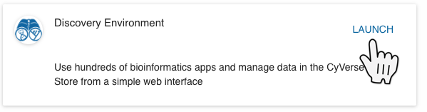
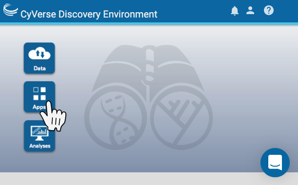
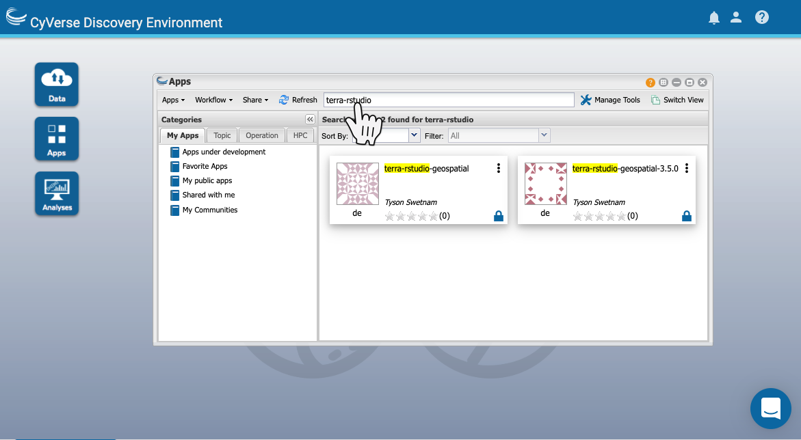
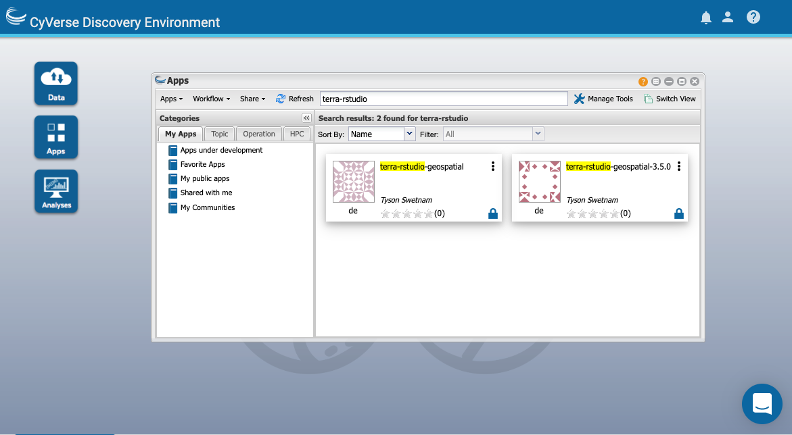
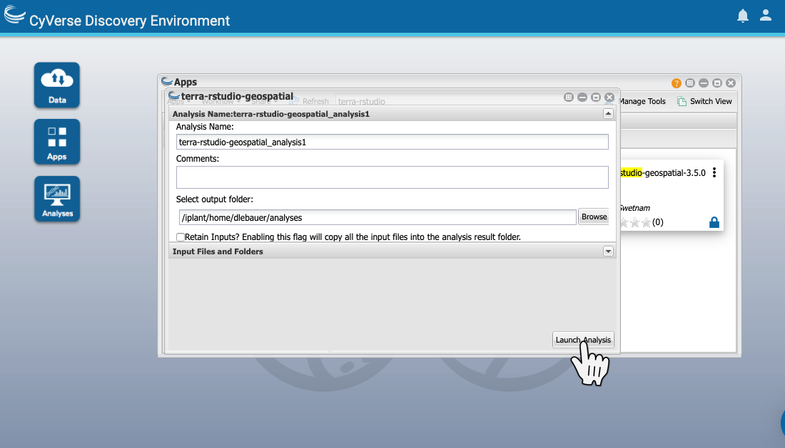
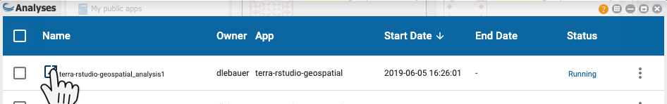
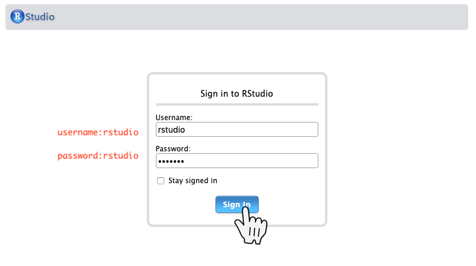

# Cloud Computing Environments

## TERRA Workbench {#workbench}

TODO _Add Description of NDS Labs Workbench_

The NDS Labs Workbench is ...

The focus of this tutorial is to get you started with the workbench.

For more details, please see the NDS Labs workbench [User Documentation](https://nationaldataservice.atlassian.net/wiki/display/NDSC/User%27s+Guide).


1. Registration and Approval ([Documentation](https://nationaldataservice.atlassian.net/wiki/display/NDSC/User%27s+Guide#User'sGuide-Registrationandapproval)) 
  * Sign up for an account at https://www.workbench.terraref.org
  * Verification email will be sent - click link in the email
  * log in to https://www.workbench.terraref.org
2. Orientation 
  * When you first log in, you will see the welcome page. 
  
  * Click the link to [add an application](https://www.workbench.terraref.org/#/store). This will redirect you to the [Application Catalog](https://www.workbench.terraref.org/#/store) where you will see a list of computing environments:


This is the Application Catalog (See also [Application Catalog](https://nationaldataservice.atlassian.net/wiki/display/NDSC/User%27s+Guide#User'sGuide-Applicationcatalog) documentation.)

Currently, the TERRA REF workbench provides the following development environments:

```{r eval=TRUE, echo=FALSE, warning=FALSE, message=FALSE}

library(dplyr)
containers <- jsonlite::fromJSON("https://api.github.com/repos/nds-org/ndslabs-specs/contents/terraref?ref=terra-ref")

x1 <- lapply(containers$download_url, function(x) {
  jsonlite::fromJSON(x, flatten = TRUE)
})

z <- lapply(x1, function(x1) {
  data.frame(name = paste0('[',x1$label,'](',x1$info, ')'), 
             description = x1$description, 
             dockerfile = paste0('[',x1$image$name,'](',paste0('https://hub.docker.com/r/', x1$image$name),')'))
}
)

knitr::kable(bind_rows(z))

```

It is important to note that the tutorials each assume that you are using a specific programming environment.

|Topic |folder| Description | Application |
|----|----|----|---|---|
|Trait data | /traits | extracting plant and plot level summaries | Rstudio |
|Sensor Data | /sensors |  | pyClowder-netcdf and Rstudio-geospatial |
|pyClowder  | coming soon | adding algorithms to pipeline | Cloud9 and JupyterLab|

### Launching An Application

[Full Documentation](https://nationaldataservice.atlassian.net/wiki/display/NDSC/User%27s+Guide#User'sGuide-Launchinganapplication)

### Application 1: the command line 

Most of these applications allow you to use the basic command line tools. 

We will start with the most simple application, the Docker command-line environment

1. on the docker application, click 'add' 


2. click 'view' 


3. This will bring you back to the Applications tab, where you will see the Docker Application. Click 'Launch'


4. Then click the icon next to the application name to launch it


 * you will be asked to enter a username and password. These are the same credentials used by the workbench
 

5. After successfully logging in, you will se a large black screen. This is a basic terminal. 


6. This is a way of looking at the file system contents. Type the following:


```sh
pwd                                   # your current directory
echo $HOME                            # your home directory
ls /data/terraref/sites               # where the sensor data lives
ls /data/terraref/sites/ua-mac/Level1 # directory containing Level 1 data from Maricopa 
```

You should see something like this:


##### Directories

All of the application provide access to the same file systems. You will find two directories, one for your own work and one that contains files from the TERRA REF data.

* home directory is`/home/$USER/` where `$USER` is your workbench username.
* data directory is`/data/`. This directory is read-only, so you can't modify the data


#### Application 2: Rstudio Server

Now we are ready to get started! However, this command line tool is not particularly powerful. 

Lets open an environment for using data in R

Create Application: 

1. navigate back to the [Application Catalog](https://www.workbench.terraref.org/#/store)
2. Find the "RStudio Server" Application, click "Add", "View", "launch", "open" as we did in the previous tutorial
3. Credentials
  * You will again enter your workbench username and password
  * Rstudio will pop up a second request for credentials. This time both the username and password are 'rstudio'
  
  
  
  
5. Now you should see a new 'tutorials' directory has been created in your home directory
  * if you don't see this folder, you will need to [clone the tutorials repository](#rstudio-clone-tutorials)
  * There are folders with plantCV, sensors, and traits. 
     * We are interested in the traits folder
     * Note that other tutorials will not run in this Application
  * Click the "traits" directory

  
  
  * Open the file "00-BETYdb-getting-started.Rmd"

  
  
### Next Steps

Now, you are ready to move on to the first tutorial "Getting Started with BETYdb".

You can also open applications for the sensor data tutorials (Rstudio-Geospatial and Jupyter/NetCDF) and plantCV (Jupyter/PlantCV) data.

## VICE {#vice}

CyVerse provides excellent documentation for their VICE services. 
You can learn more about VICE in the [VICE documentation](https://learning.cyverse.org/projects/vice/en/latest/).
This section is intended to quickly get you up an running with the TERRA REF container on CyVerse.
It is the same Rstudio environment as is available in workbench. 
Unlike workbench, VICE does not provide a ~/data directory with all of the TERRA REF files, and it also does not have a local postgres database where you can run SQL commands. 
But, you can still access the database through its API, which means that you can use the R traits package, the BrAPI interface, the terrutils python library, and if you really want to use SQL, you can mirror the database using Docker. <!--need to cross reference tutorials here-->

1. If you don't have an account, [register here for a free account on CyVerse](https://user.cyverse.org/register).
2. [Login to CyVerse](https://user.cyverse.org).
3. Launch the Discovery Environment

4. Select the Apps button

5. Search for the terra-rstudio-geospatial application (VICE container)

6. Launch the TERRA Geospatial Rstudio Application

7. Open the Analysis Section


7. Launch the Rstudio container

8. Log in to Rstudio with the username 'rstudio' and password 'rstudio'


## Clone the 'Tutorials' Repository in Rstudio {#rstudio-clone-tutorials}

With the RStudio Application Open

1. Click File --> New Project


1. Click "Version Control"


1. Click "Git"


  
1. Type https://github.com/terraref/tutorials 
  * this is the GitHub repository full of tutorials
  * Click "Create Project"

  
